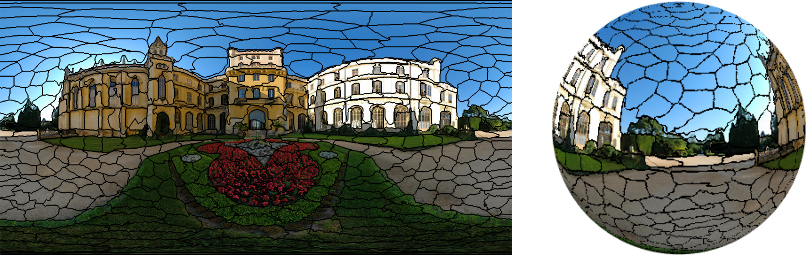

# Deep Spherical Superpixels

## Overview

Implementation of paper:   [PDF]()
```
@article{giraud2024dss,
  title={Deep Spherical Superpixels},
  author={Giraud, R{\'e}mi and Cl{\'e}ment, Micha{\"e}l},
  journal={arXiv preprint},
  year={2024}
}
```

- Deep learning-based superpixel segmentation of 360° spherical images: 



<br />

### Requirements

- PyTorch >= 1.4
- scikit-image
- matplotlib
- CUDA (may necessitate to remove nvidia-cuda-toolkit and install cuda-toolkit properly from [here](https://developer.nvidia.com/cuda-toolkit))

<br />

### Use
#### Training
```
python train.py --root /path/to/PSD
```

#### Inference
```
python inference --image /path/to/image --weight /path/to/pretrained_weight
```


<br />

### Data

The dataset of 75 manually annotated spherical images capturing panoramas is given in PSD.zip file (15Mo) or here:
[here](https://github.com/tdsuper/SphericalSuperpixels)  
These images are extracted from the [SUN360 dataset](https://vision.princeton.edu/projects/2012/SUN360/data/) 

The Panoramic Semantic Segmentation in the Wild (WildPASS) Dataset is available:
[here](https://github.com/elnino9ykl/WildPASS)


<br />

### Use of the GGR regularity metric 

- Generalized Global Regularity Metric (GGR) for evaluation of spatial superpixel regularity in the spherical space:
```
@InProceedings{giraud2020sphsps,
    author   = {Rémi Giraud and Rodrigo Borba Pinheiro and Yannick Berthoumieu},
    title    = {Generalization of the Shortest Path Approach for Superpixel Segmentation of Omnidirectional Images},
    booktitle  = {Pattern Recognition (PR)},
    YEAR   = {2023},
}
```

<br />

### License

(C) Rémi Giraud, 2024 
remi.giraud@u-bordeaux.fr  
[https://remi-giraud.enseirb-matmeca.fr](https://remi-giraud.enseirb-matmeca.fr)  
ENSEIRB-MATMECA (Bordeaux INP), Laboratory IMS

This code is free to use, share and modify for any non-commercial purposes.
Any commercial use is strictly prohibited without the authors' consent, also including following works since DSS is based on their code:

Superpixel Sampling Network (SSN) paper: [https://arxiv.org/abs/1807.1017](https://arxiv.org/abs/1807.1017)

Original code: [https://github.com/NVlabs/ssn_superpixels](https://github.com/NVlabs/ssn_superpixels)

Pytorch code: [https://github.com/perrying/ssn-pytorch](https://github.com/perrying/ssn-pytorch)


